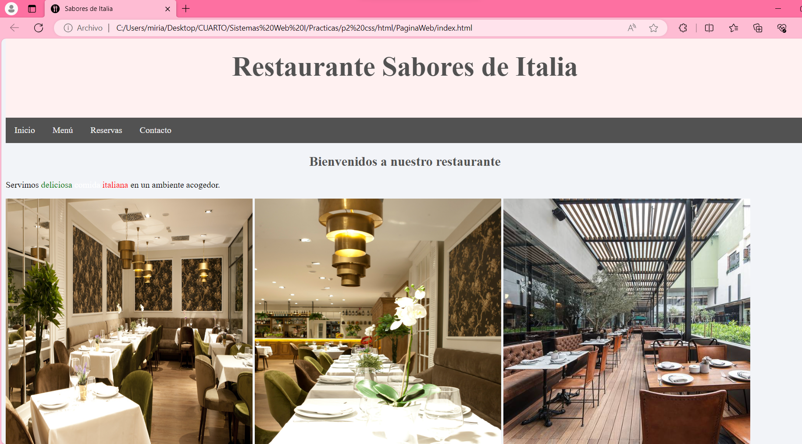

# Página web en HTML
Sencilla página web en HTML para la asignatura Sistemas Web I. 

## Sobre la página
Es una página web de un restaurante italiano dividida en 4 partes: Inicio, Menú, Reservas y Contacto.

## Elementos HTML usados
- Estructura básica de html (html, head, title y body).
- Favicon
- Encabezados 
- Listas ordenadas
- Imágenes
- Tablas
- Enlaces
- Span
- Formulario

## CSS Añadido
- Cabecera con estilo
- Menú lateral con estilo
- Columnas
- Estilo de tabla
- Footer
