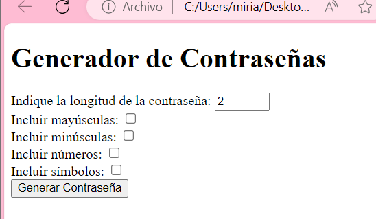

# Web que genera una contraseña
Sencilla página web en HTML y Javascript para la asignatura Sistemas Web I. 

## Sobre la página
- Es una página web que genera contraseñas aleatorias.
- Busca un diccionario y guarda la información en una variable
- Usa el diccionario para generar la contraseña con varias palabras aleatorias
- Añade opcines de configuración:
    Número de letras
    Incluir mayúsculas
    Incluir minúsculas
    Incluir números
    Incluir símbolos