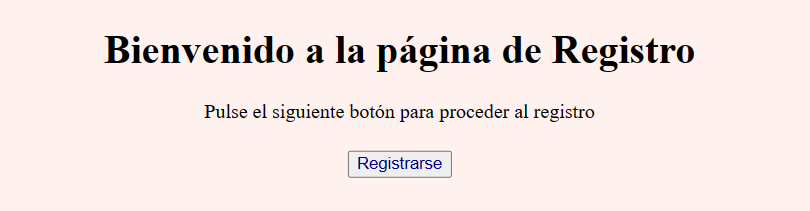

# Web que genera una contraseña
Sencilla página web en HTML, CSS y Javascript con jQuery para la asignatura Sistemas Web I. 

## Sobre la página
- Es una página web con un formulario de registro.
- El formulario contiene los siguientes campos:

    - Nombre y apellidos.

    - Email.

    - Teléfono.

    - Contraseña.

    - Un botón para enviar los datos.

    - Un botón para cancelar el registro.
- Los requisitos de cada campo para poder enviar el formulario son:

    - Nombre y Apellidos solo puede estar compuesto por letras y tienen que ser mínimos 2 palabras.

    - El Email debe tener un formato válido.

    - El Teléfono solo puede contener números y deben ser 9 dígitos sin espacios.

    - La Contraseña debe contener mínimo 8 carácteres con al menos una mayúscula, una minúscula y un número. 
- Al enviar el formulario aparece una alerta avisando que se ha registrado correctamente. 